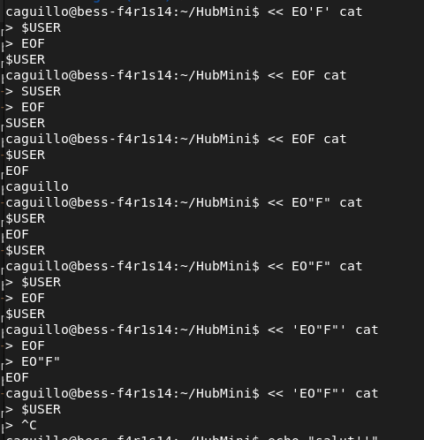

# Minishell

0) isatty?

1) On se ramene a un input to read comme ca:
> abc def | ghi | jkl << mno < < pqr > stu | vwx < yz

2) On split(' '), on a tableau de "truc"
[">","abc","def","|","ghi","|","jkl","<<","mno","<","<","pqr",">","stu","|","vwx","<","yz"]

3) On definit le type de chaque "truc" (avec un code/define/enum?)
- limiter (0)
- infile (1)
- outile (2)
- outfile+ (3)
- symbol (4)
- cmd (5)
- arg (6)
(autre type?)

pour obtenir un  tableau de "type" correspondant 
[symbol, outfile, cmd, symbol, cmd, symbol, cmd, symbol, ...]

Pour trouver le tableau des types voici un pre-algo
je prends un "truc" (hors symbol)
1) | avant => cmd
2) | apres => cmd ou arg => access => soit cmd soit arg et truc-1 = cmd
3) < avant => infile
4) > avant => outfile
5) >> avant => outfile+
6) << avant => limiter
7) rien => si 1er => cmd sinon arg du 1er

How to execve:
~$ >> out cat < Makefile << eof > out2 | << eof ls -la >> out3 | >> out4 > out3 grep mini < out2 --> ok

Solved:
1) << eof echo toto | << eof2 cat --> ok
2) cat < Makefile | echo toto | wc >> out --> ok
3) cat | wc << eof --> ok as bash (~~but next weird (need to enter on each new prompt)~~)
5) wc << eof | cat --> ok
4) sleep 2 | sleep 2 | cat << e | sleep 2 | cat << f --> ok
6) wc << eof | ls | wc << e | cat --> ok
7) wc << eof | cat > out | wc << eof | cat --> ok
8) << eof --> ok
9) << eof | << rt --> ok
10) << eof | << rt wc --> ok
11) cat << ty  | cat << eof | wc --> ok
echo "	" | car -e --> invalid free + leak (cas CMD not found + ARG) --> ok
toto | wc < titi --> Warning: invalid file descriptor -1 in syscall close() --> ok

Issues:
1) << eof | << --> ok
2) << | << eof --> ok
3) << eof << <<< --> ok
4) cat || wc (cat is working until ctrl+c) --> put in stx err
5) wc < Makefile || wc (exec 1er wc, exit 0) --> pour nous syntax error
6) wc < Makefile wc (wc: wc: No such file or directory) --> ok
7) < >> --> ok

Valgrind:
valgrind --track-fds=yes --trace-children=yes --leak-check=full --show-leak-kinds=all --track-origins=yes
1) << eof --> ok
2) << eof < Makefile | << eof > out -->ok
3) << eof | Makefile --> ok
3) < Makefile | << eof toto --> ok
3) toto --> ok
4) << eof | < Makefile --> ok
4) < Makefile | << eof --> ok
5) << eof < Makefile | wc --> ok
6) cat Makefile | < out --> SIGPIPE ok fd ?

Syntax error to be checked
1) at least one CMD by block (and only one ?) --> wrong, may have no command, just heredoc or file, solved 
2) last word of the prompt is not a pipe
3) we need to be sure there is a LIMITER just after HEREDOC

Ask:
- open (0666), mais rw/r/r ??? 
- double_free((void **)(mini->cmd_arg));
- mettre NULL apres free

NB:
1) un truc a tester a la fin: 1) lancer minishell 2) faire une modif dans le code 3) faire make dans le minishell en cours 4) lancer le nouveau minshell dans minishell 5) verifier la modif 6) exit 7) verififier qu'il n'y a plus la modif
2) lancer signal exe de temp_signal.c

STD OUT Builtin issue:
Makefile | wc --> ok
echo tutu | wc --> ok
echo titi >> out | wc --> ok - to be recheck and ckean in the code builtin_files 

sleep 3 | exit --> do not exit --> ok exit the child
exit | echo toto --> toto, and do not exit --> ok exit the child

Solved:
1) 16hd ok 17 = bash: maximum here-document count exceeded --> ok

Issues:
2) /tmp --> bash: /tmp: Is a directory
2) / --> bash: /: Is a directory
3) cd /tmp ls --> pas tout a fait pareil
4) >test1 < $vvv  >test2 --> bash: $vvv: ambiguous redirect mais test1 cree
5) cd > out --> vide out
5) exit > out --> vide out
6) titi \" \' tot\'o\" tutu \'tata\' --> double free

bash: exit: 5000000000000000000000000000000000: numeric argument required
bash: exit: bla12: numeric argument required
500000 % 256 -> 32 

Verifier les printf
Verifier les fonctions autorisees
Potection type dup2 
Proteger les fonctions des builtins --> exit
echo "$?yoyo"
echo "$ ?"
echo toto"$PWD   a"
echo toto'$PWD   '
echo toto'$PWD'

<< eof | --> attend une cmd (on peut mettre meme un heredoc) --> nous heredoc et c'est tout
cat << eof | (fais la 1ere partie, et attend une commade apres le EOF) --> nous heredoc et c'est tout
$PWD (bash: /home/caguillo/HubMini: Is a directory) directory vs cmd ??? -->

Testeur 146
https://github.com/LucasKuhn/minishell_tester

Testeur 423
https://github.com/eyJvcy/minishell_tester

Testeur:
https://github.com/kichkiro/minishell_tester/tree/main
ls / | grep c | cat > file1 --> 163 mais en fait ok en refaisant test

Fichier touch ignore
Puis dans Makefile
valgrind: all
		valgrind -q --suppressions=$(PWD)/ignore --trace-children=yes \
		--leak-check=full --show-leak-kinds=all --track-origins=yes --track-fds=yes \
    	./minishell

